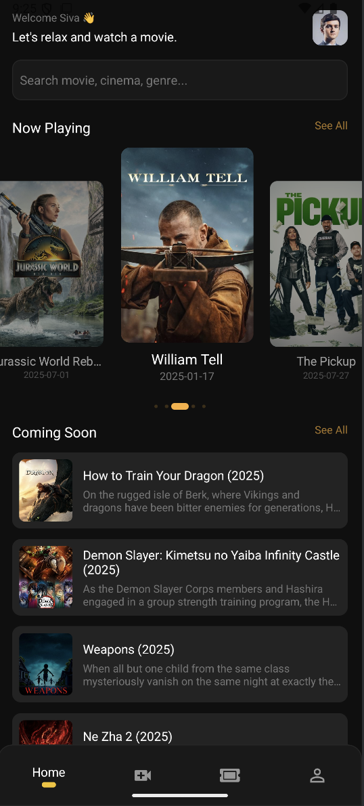
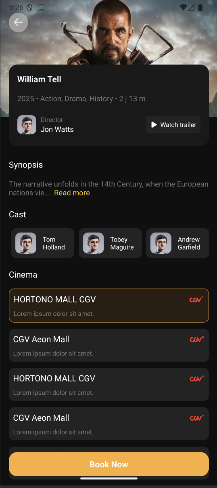

# Movie Catalogue App

A React Native (Expo) mobile app that displays popular and upcoming movies using **The Movie Database (TMDB)** API.  
Built with **TypeScript**, modular components, and a focus on clean code, responsiveness, and pixel-perfect UI reproduction.

---

## Features

- **Home Screen**
  - Welcome Header
  - Search bar (UI only in this version)
  - “Now Playing” movies carousel
  - “Coming Soon” section
  - Responsive layout for different screen sizes

- **Movie Details Screen**
  - Large hero backdrop with movie title and genres
  - Movie runtime and director info
  - Synopsis section
  - Cast carousel
  - Cinema banners carousel
  - Persistent "Book Now" button

- **Navigation**
  - Expo Router with stack navigation
  - Bottom navigation bar (UI only)

---

## Tech Stack

- **React Native** (Expo)
- **TypeScript** for type safety
- **Axios** for API requests
- **Expo Router** for navigation
- **TMDB API** for real data
- Centralized **theme and styling variables**

---
## Project Structure

movie-catalogue/
│
├── app/
│ ├── components/ # Reusable UI components
│ ├── movie/ # Movie details page
│ ├── services/ # API service layer
│ ├── types/ # Shared TypeScript types
│ ├── constants/ # Styling and API constants
│ ├── movies.tsx # Home screen
│ ├── _layout.tsx # Navigation layout
│ └── index.tsx # Entry point
│
├── assets/ # Images and icons
└── README.md

---

## Setup Instructions

1. **Clone the repository**
   ```bash
   git clone https://github.com/raji-perabattula/Panda-hub-coding-challenge.git
   cd movie-catalogue
2. **Install dependencies**
    npm install
3. **Configure API key**
    Sign up at [TMDB](https://www.themoviedb.org/) and get an API key.
    In app.json, add:
    "extra": {
        "api_key": "YOUR_TMDB_API_KEY"
    }
4. **Run the App**
    npx expo start
5. **Run on Android Emulator**
    Install [Android Studio](https://developer.android.com/studio).
    Open AVD Manager and create a device (Pixel 6 or similar).
    Start the emulator.
    In the terminal:
        npx expo start --android

---

# Code Highlights

**TypeScript Usage**
All components and services use strict typing via interfaces and shared types in app/types.

**Axios Integration**
API calls are centralized in app/services/api.ts with interceptors adding the API key and default params automatically.

**Modular Components**
UI elements are split into small, reusable pieces (NowPlayingCard, CarouselCard, CarouselSection, etc.).

**Styling Consistency**
Colors, font sizes, and spacing are defined in StylingVariables.ts for easy theming.

**Responsive Layout**
Components are designed to adapt to various device sizes while keeping a consistent look.

---

# Future Improvements
Implement search functionality
Add trailer playback
Integrate real cast and cinema data from the API
Improve accessibility (ARIA roles, dynamic font scaling)
Implement with actual data and sign in integration
Implement book now

---

# Screenshots
**Landing Page**

**Details Page**


---

# Author: Rajyalakshmi Siva
# API Source: [The Movie Database](https://www.themoviedb.org/)

---

## Detailed file-by-file overview
<!-- Main parts of the application are as follows: -->
Pages: 
    app/index.tsx, 
    app/movies.tsx, 
    app/movie/[id].tsx
Components: 
    NowPlayingCard.tsx, 
    BottomNav.tsx, 
    CarouselCard.tsx, 
    NowPlayingCarousel.tsx, 
    CarouselSection.tsx
Services: 
    services/api.ts (Axios setup), 
    services/movieService.ts (movie API calls)
Types: 
    types/movie.ts
Constants: 
    StylingVariables.ts, 
    BaseUrls.ts
Expo config: 
    app.json, 
    expo-env.d.ts

<!-- Pages files content - what does it do ? -->
Routing
    -> index.tsx just re-exports movies.tsx as the home screen.
    -> _layout.tsx sets up a Stack navigation using Expo Router without a header.
movies.tsx
    -> Fetched popular movies and upcoming movies from the TMDB API service on mount.
    -> Used TypeScript types (Movie) for data consistency.
    -> Implemented “See All” toggle logic for both Now Playing and Coming Soon carousels.

    UI sections:
        -> Welcome header with user avatar.
        -> Search bar (non-functional placeholder).
        -> NowPlayingCarousel component.
        -> CarouselSection (common component for carousels) for Coming Soon.
        -> Persistent bottom navigation bar (BottomNav).
movie/[id].tsx
    -> Fetches movie details using ID from route params.
    -> Displays a hero backdrop image, details card (title, genres, runtime, director info).
    -> “Watch trailer” button (non-functional placeholder).
    -> Synopsis with “Read more” link (text only, no expansion logic).
    -> Two carousel sections: cast list (dummyCast) and cinema banners (dummyCinemaData).
    -> A persistent Book Now button at the bottom.

<!-- Components content - what does it do? -->
NowPlayingCarousel.tsx
    -> Wraped a horizontal FlatList of NowPlayingCard components.
    -> Props are typed to accept an array of Movie.
    -> Added animation while scrolling, so that the midle card in zoomed in.
    -> Added infinite looping functionality, so that the list doesnt end while scrolling by handling a case where user reached end.
    -> Added pagination effect with animation while scrolling the cards.(only for initial 5 cards visibility).
NowPlayingCard.tsx
    -> Displayed a single “Now Playing” movie card.
    -> Props are strongly typed (Movie type from types/movie.ts).
    -> Includeed poster image, rating badge, and title.
    -> Used TouchableOpacity to navigate to the movie details page with onPress functionality.
CarouselSection.tsx
    -> Generic section component with:
        Title
        “See all” link if applicable
        Horizontal | Vertical list of CarouselCard items (optional params added)
    -> Accepts typed props for title, data array, and item rendering.
    -> Used for Upcoming movies, Cast, and Cinemas.
CarouselCard.tsx
    -> Reusable card for horizontal carousels.
    -> Shows an image(optional) and title, with optional description.
    -> Props are typed via an interface for flexibility.
    -> Used in multiple carousel sections (cast, cinemas, upcoming movies).
    -> For Cinema carousel in movie details page highlighted card on pressing is handled by index value.
    -> Written all section specific styles.
BottomNav.tsx
    -> Only shown on movies list page as per given reference pictures.
    -> Fixed bottom navigation bar.
    -> Four icons.
    -> No navigation functionality yet — just visual.

<!-- Services and Constant files -->
api.ts
    -> Centralized Axios instance with:
        grabbed baseURL from constants.
        used 8s timeout.
        Request interceptor that automatically appends:
            api_key (from Expo config).
            language=en-US.
    -> Keeping API calls DRY and consistent.
movieService.ts
    -> Exports three async functions:
        getPopularMovies(page)
        getMovieDetails(id)
        getUpcomingMovies(page)
    -> Uses generic Axios response typing to ensure TypeScript catches shape mismatches.
    -> Returns raw data for flexibility in UI.
types/movie.ts
    -> Strongly typed models:
    -> Movie (base type for now playing and coming soon listings)
    -> MovieDetails (extends Movie with runtime, genres, backdrop, etc.)
    -> Cast and CinemaData for movie details screen carousels.
    -> Includes MovieOrCast union type for generic card rendering and usage in component.
StylingVariables.ts
    -> Centralized colors, font sizes, spacings, and border radii.
    -> Promoted design consistency and easy updates.
BaseUrls.ts
    -> API and image base URLs.
    -> Dummy user/cinema images for placeholder content.
    -> Predefined dummy cast and cinema data arrays for static sections.
